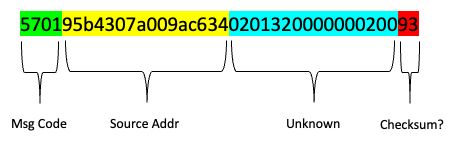
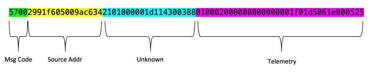
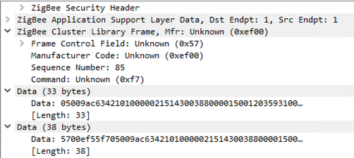

# Enecsys Zigbee
Reverse engineering the Enecsys Solar Inverter zigbee protocol to integrate into HomeAssistant.

Enecsys Inverters typically use a propritary gateway device to collect and forward telemetry data. Enecsys went into administration in 2015 and the used market now has an abundance of cheap micro inverters but a destinct lack of any of the gateway devices.

This project is to attempt to reverse engineer the Zigbee protocol Enecsys used to directly collect telemetry from inverters and ultimately integrate into HomeAssistant.


## Basic Requirements
Enecsys's implementation of zigbee requires 3 paramenters to match to establish a network.

1. Trust-Center Link Key = "ENCSYS-SOLAR-NET"
2. PAN id = 0x02aa
3. Stack Profile = 0x00
4. Permit Join must always be active

Most Zigbee network parameters are configurable at runtime, however according the Zigbee 3 spec the TC-Link Key can only be set at complilation. It was therefore required to recompile the Z-Stack firmware for the Sonoff Zigbee Dongle Plus I was using. [Z-Stack 3.x.0 recompiled](firmware/znp_CC1352P_2_LAUNCHXL_tirtos_ccs.hex)

The PAN id and Stack Profile can be configred either in Zigpy configuration before the network is formed or by modifying the NVRAM with Zigpy_ZNP.Tools after the network has been formed.

Permit join must always be active as the radios are only active when the solar panel is generating power. Join's do not persist, a new association request is sent after each power cycle.

## Zigbee Commands

Once a basic zigbee network has been formed with the required settings the inverters will begin to associate with the network. After successful association and key exchange there is a brief exchange between the inverter and the gateway before telemetry is transmitted periodically.

Inverter Request:

```5701ef55f705009ac63405ef55f705009ac63402010a00000097```

Gateway Response:

```570195b4307a009ac634020132000000020093```

This part is not currently understood and without it the Inverters leave the zigbee network without transmitting any telemetry.

Additional captures were done to check the request/reply for all inverters:

```
Serial 100012445
Mac 34c69a0005f6119d
=====================
Request:  57019d11f605009ac634059d11f605009ac63402010a000000c5
Response: 570195b4307a009ac634020132414a00020008

=====================
Serial 100048236
Mac 34c69a0005f69d6c
=====================
Request:  57016c9df605009ac634056c9df605009ac63402010a0000000f
Response: 570195b4307a009ac634020132000000020093

=====================
Serial 100048590
Mac 34c69a0005f69ece
=====================
Request:  5701ce9ef605009ac63405ce9ef605009ac63402010a00000049
Response: 570195b4307a009ac634020132006f00020024

=====================
Serial 100095471
Mac 34c69a0005f755ef
=====================
Request:  5701ef55f705009ac63405ef55f705009ac63402010a00000097
Response: 570195b4307a009ac634020132000000020093
```
Gateway response:



While not currently understood what this data is, it does appear to be sufficient to blindy recycle a previous response to initiate the inverters into reporting telemetry.


## Data Payload
Example data payload extracted from sniffing the traffic between the inverters and a genuine gateway device.



Wireshark attempts to decode this as a ZCL (Zigbee Cluster Library) frame. This causes some oddities as it's not intended to be a ZCL frame, however this could come in useful further along when attempting to get integration into HomeAssistant as we will probably need to make the messages appear to be standard zigbee frames. ie. part of the mac address becomes the 'command'.



Code snippet to test unpacking and processing:
(With thanks to [Omoerbeek](https://github.com/omoerbeek/e2pv) for previous work done on similar data)
```
<?php
$str = "57002991f605009ac6342101000000be1430038800003b0031033e3100f42303a905430000e6";
$data = hex2bin($str);
$v = unpack("H4cmd/H16mac/H20ukn/CState/nDCCurrent/nDCPower/nEfficiency/cACFreq/nACvolt/cTemp/nWh/nkWh/n/H2CRC",$data);
print_r($v);
```
Result:
```
Array ( 
    [cmd] => 5700 
    [mac] => 2991f605009ac634 
    [ukn] => 2101000000be14300388 
    [State] => 0 
    [DCCurrent] => 59 
    [DCPower] => 49 
    [Efficiency] => 830 
    [ACFreq] => 49 
    [ACvolt] => 244 
    [Temp] => 35 
    [Wh] => 937 
    [kWh] => 1347 
    [1] => 0 
    [CRC] => e6 )
```

## Proof of Concept

Initial PoC code has been published [here](PoC/__main__.py). This uses the existing Zigpy libraries that are also used in Home Assistant. Initially I did this for compatability as i wanted to integrate directly but this is not looking like an option any more as I can't see any way to format the non-standard message types into ZCL packets.

The PoC uses the callback function from the handle_message event to pass all messages and read out the ones of interest. This does mean there are errors logged for unhandled messages from Zigpy but we just extract and process the data ourselves as they require no response from a Zigbee point of view.

Data is saved out in JSON format to telemery.json and updated for every telemetry packet received, approx. once per minute.

```
{
    "ef55f705009ac634": {
        "serial": "100095471",
        "mac": "34c69a0005f755ef",
        "state": 0,
        "dc_current": 0.45,
        "dc_watts": 21,
        "dc_volt": 46.666666666666664,
        "efficiency": 0.96,
        "ac_freq": 50,
        "ac_volt": 240,
        "ac_watts": 20.16,
        "temp": 23,
        "wh": 530,
        "kwh": 1349,
        "lifetime_wh": 1349530
    },
    "9d11f605009ac634": {
        "serial": "100012445",
        "mac": "34c69a0005f6119d",
        "state": 0,
        "dc_current": 0.525,
        "dc_watts": 14,
        "dc_volt": 26.666666666666664,
        "efficiency": 0.666,
        "ac_freq": 49,
        "ac_volt": 238,
        "ac_watts": 9.324,
        "temp": 20,
        "wh": 699,
        "kwh": 2284,
        "lifetime_wh": 2284699
    },
    "6c9df605009ac634": {
        "serial": "100048236",
        "mac": "34c69a0005f69d6c",
        "state": 0,
        "dc_current": 0.325,
        "dc_watts": 15,
        "dc_volt": 46.15384615384615,
        "efficiency": 0.96,
        "ac_freq": 49,
        "ac_volt": 253,
        "ac_watts": 14.399999999999999,
        "temp": 21,
        "wh": 799,
        "kwh": 1633,
        "lifetime_wh": 1633799
    },
    "ce9ef605009ac634": {
        "serial": "100048590",
        "mac": "34c69a0005f69ece",
        "state": 0,
        "dc_current": 1.3250000000000002,
        "dc_watts": 44,
        "dc_volt": 33.20754716981131,
        "efficiency": 0.8300000000000001,
        "ac_freq": 50,
        "ac_volt": 251,
        "ac_watts": 36.52,
        "temp": 25,
        "wh": 174,
        "kwh": 1821,
        "lifetime_wh": 1821174
    }
}
```

## Home Assistant Inegration

Sadly, we can't just add the inverters as stanard zigbee devices into Home Assistant.

The next best option was to use what we've learned here to create a docker based Virtual Enecsys Gateway that can either be ran on the Home Assistant device or elsewhere if preferred.

This respository is focused on the reverse engineering aspect. You can find the Enecsys Virtual Gateway in [this repository](https://github.com/bulldog5046/Enecsys-vgw)